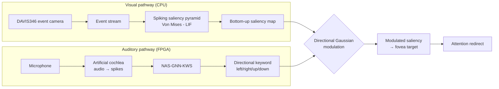

# Neuromorphic language-guided visual attention

> A neuromorphic system in which language steers vision. A spoken word reshapes where an event-driven attention model looks, redirecting the fovea toward the named direction.

---

## Table of contents

- [Overview](#overview)
- [Architecture](#architecture)
- [Demos (TBD)](#demos)
- [Repository structure (TBD)](#repository-structure)
- [1. Visual attention (KWS modulation)](#1-visual-attention-kws-modulation)
- [2. DAVIS346 event camera](#2-davis346-event-camera)
- [3. NAS and KWS on FPGA](#3-nas-and-kws-on-fpga)
- [Papers and references](#papers-and-references)
- [Team](#team)
- [Acknowledgements](#acknowledgements)

---

## Overview


This system lets a spoken word modulate low-level visual processing directly, so language changes what the system finds salient - and therefore where it looks - end to end with event-based sensing and spiking computation.

The pipeline couples two neuromorphic pathways:

- **Visual pathway.** A DAVIS346 event camera feeds a spiking saliency pyramid (Von Mises orientation filters over LIF neurons), producing a bottom-up saliency map.
- **Auditory pathway.** An artificial cochlea turns speech into spikes that drive a GNN-based keyword-spotting network (NAS-GNN-KWS) deployed on an Opal Kelly XEM7310-A200 (Artix-7) FPGA.

When a directional keyword (left / right / up / down) is detected, it applies a directional Gaussian boost to the saliency map, biasing attention toward the spoken target.

## Architecture



## Demos (TBD)

| Visual attention (KWS modulation) | DAVIS346 live camera | KWS on FPGA |
| :---: | :---: | :---: |
|  |  |  |
| *A spoken word boosts saliency in its direction* | *Live event stream driving attention* | *Keyword spotting on Artix-7* |

TBD: Demo video on youtube

## Repository structure (TBD)


---

## 1. Visual attention (KWS modulation)

### 1.1. Environment setup

**a) Create the environment**

```bash
conda create -n kws_env python=3.10 -y
conda activate kws_env
```

**b) Install requirements**

```bash
pip install numpy opencv-python torch scipy scikit-image sinabs torchvision dv-processing
```

## c) Run

The `data/` folder contains four `.npy` files with synthetic scenes. Choose the one you want to visualize,use your own (check Generating synthetic scene to know more), or use live events from the camera.

| File | Scene |
|------|-------|
| `3_different_circles_346x260.npy` | *(insert image)* |
| `4_different_objects_.npy` | *(insert image)* |
| `6_different_objects_346x260.npy` | *(insert image)* |
| `7_different_objects_346x260.npy` | *(insert image)* |

Then pick the script that matches your setup:

```bash
# Saliency map only (no modulation, uses .npy files)
python get_only_saliency.py

# KWS modulation with synthetic data - type commands in the terminal
python kws_mod_live_words.py

# KWS modulation only (no camera)
python kws_mod.py

# KWS modulation with camera - live camera + written commands
python kws_mod_cam_words.py

# Full experiment - live camera + spoken commands
python kws_mod_cam_fpga.py
```
---

## 2. DAVIS346 event camera

Installing the requirements in [step 1.1](#11-environment-setup) already sets up the library used to talk to the camera. If you'd like to explore the camera directly, install the [DV app](https://inivation.gitlab.io/dv/dv-docs/) or follow inivation's tutorial.

### 2.1. Connect and verify

Plug the camera in via USB and check that it's detected:

```bash
lsusb
```

You should see something like:

```text
Bus 004 Device 002: ID 152a:841a Thesycon ... INI DAViS FX3
```

<details>
<summary>🐞 <b>Troubleshooting</b> — nothing shows up, or a permission error on open</summary>

<br>

If nothing appears, it's likely a USB/driver issue. If you hit a **permission error** when the script opens the camera, grant access to the device:

```bash
sudo chmod 666 /dev/bus/usb/$(lsusb | grep -i inivation | grep -o '[0-9]*:[0-9]*' | head -1 | tr ':' '/')
```

Or add yourself to the `plugdev` group **permanently** (log out and back in afterwards):

```bash
sudo usermod -aG plugdev $USER
```

</details>

---

## 3. NAS and KWS on FPGA

Deployment target: Opal Kelly XEM7310-A200 (Xilinx Artix-7). 

Below you can see an overview of the setup.


## 3. NAS and KWS on FPGA

**Deployment target:** Opal Kelly XEM7310-A200 (Xilinx Artix-7).

---

### 3.1. Software — train and export the model

> **Goal:** produce a calibrated model checkpoint and export the quantized weights for hardware deployment.

> [!TIP]
> You can skip training entirely by requesting the pre-trained calibrated checkpoint and weight files from the authors. 

**a) Clone the model repo and install dependencies**

```bash
git clone https://github.com/vision-agh/NAS-GNN-KWS.git
cd NAS-GNN-KWS/SW
pip install -r requirements.txt
python setup.py build_ext --inplace  # compile the C++ graph generator
```

**b) Train the model**

```bash
python train_kws.py
```

This runs float training followed by quantization-aware training (calibration). The best calibrated checkpoint is saved to `results/kws/<run_id>/best_model_calibration.pth`.

**c) Export the quantized weights**

```bash
python generate_weights.py --checkpoint results/kws/<run_id>/best_model_calibration.pth
```

This writes the `.mem` weight files to `HW/mem/`, which Vivado will load during synthesis.

---

### 3.2. Hardware — deploy on the FPGA

> **Goal:** synthesize the bitstream, program the XEM7310-A200, and run inference from the host PC.
>
> For board-specific setup (drivers, FrontPanel SDK, udev rules), see the dedicated guide: [XEM7310-A200 FPGA Setup](https://github.com/Neuro-inspired-Perception-and-Cognition/XEM7310-A200-FPGA-setup). Below is an overview of the main components to use the FPGA.


**a) Install the host-side tooling**

```bash
pip install pyokaertool
```

**b) Open Vivado**

```bash
/xilinx/Vivado/2022.2/bin/vivado
```

**c) Create a new Vivado project**

Set the target part to `xc7a200tfbg484-1` and add the following sources (uncheck *Copy sources into project* for all repo files):

| Source type | Location |
|---|---|
| Design sources (`.sv`, `.v`) | `HW/src/`, `HW/src/GCNN/`, `HW/src/board_wrapper_files/` |
| Design sources (`.vhd`) | `HW/src/NAS/` |
| FrontPanel HDL (`.v`) | From your FrontPanel SDK installation |
| IP files (`.xci`) | `HW/ip/` — **exclude** `clk_wiz_zcu.xci` |
| Constraints (`.xdc`) | `HW/const/ok_constr.xdc` |

**d) Configure the design**

1. Set `ok_top_wrapper` as the **top module**.
2. In the IP Catalog, create the `clk_wiz_ok` IP (Clocking Wizard): 200 MHz differential input → `clk_out1` at 48 MHz, `clk_out2` at 200 MHz.
3. Run **Upgrade All IPs** to retarget any locked IPs to the Artix-7.

**e) Synthesize, implement, and generate the bitstream**

---

## Papers and references

- **NAS-GNN-KWS** — graph-based keyword spotting used on the FPGA. <https://github.com/vision-agh/NAS-GNN-KWS>
- **DAVIS346 / dv-processing** — event-camera SDK. <https://inivation.com>


## Team

| Name | Affiliation | Role | Email |
| --- | --- | --- | --- |
| Rayane Rocha Rodrigues dos Santos | NPC Lab, CIIRC & FEL, CTU · UFPB | Bachelor student | rrrds@academico.ufpb.br |
| Dr. Giulia D'Angelo | NPC Lab, FEL, CTU | Supervisor | giulia.dangelo@fel.cvut.cz |
| Dr. Karla Štěpánová | ROP group, CIIRC, CTU | Co-supervisor | karla.stepanova@cvut.cz   |
| Piotr Wzorek | EVS group, AGH University, Kraków | Collaborator | pwzorek@agh.edu.pl |
| Paolo Ritirato | NPC Lab, FEL, CTU | Collaborator | paolo.ritirato@fel.cvut.cz |

## Acknowledgements

This work was carried out at the Neuro-inspired Perception and Cognition (NPC) Lab at FEL and the Robotic perception group at CIIRC in the Czech Technical University in Prague, supported by a [ROBOPROX Women's Forum Fellowship](https://roboprox.eu/news/new-awardees-of-the-roboprox-women-forum-grants/). 
